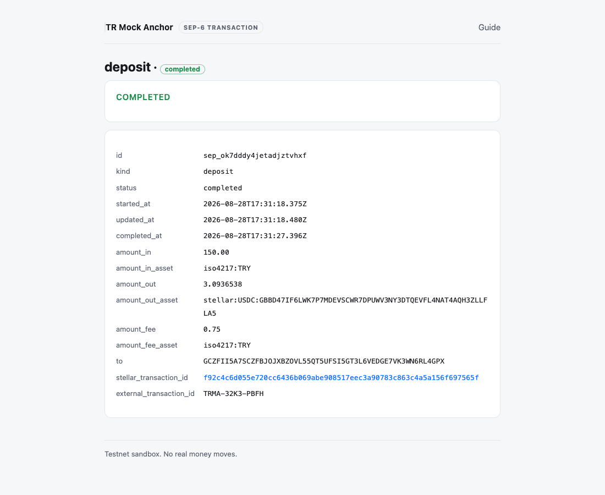
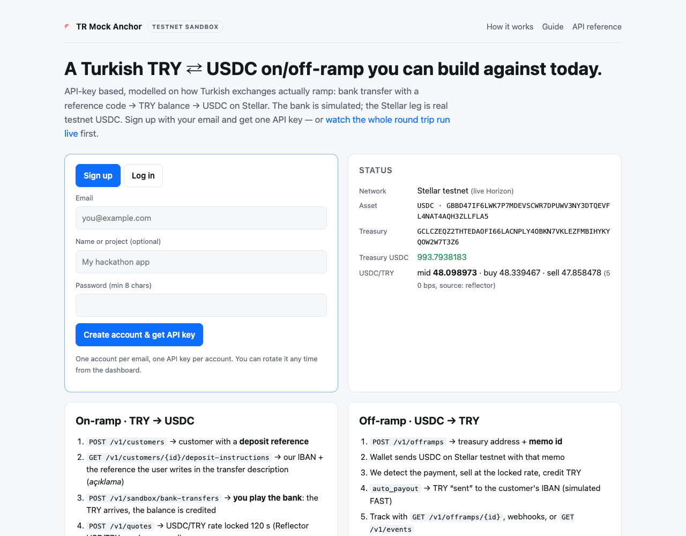
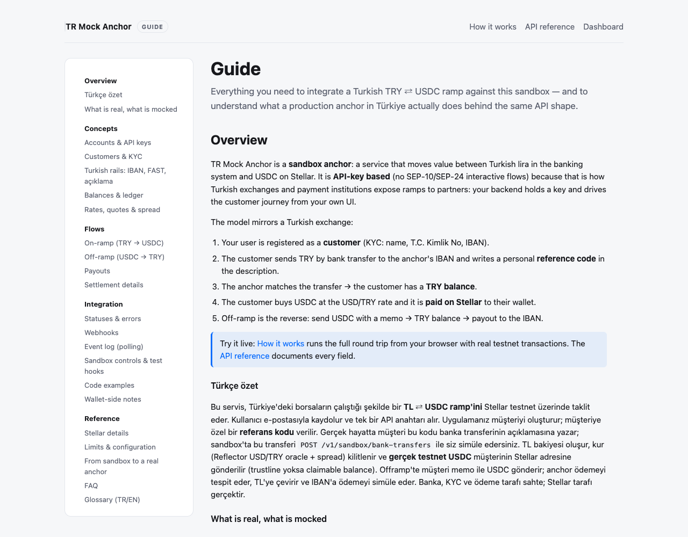
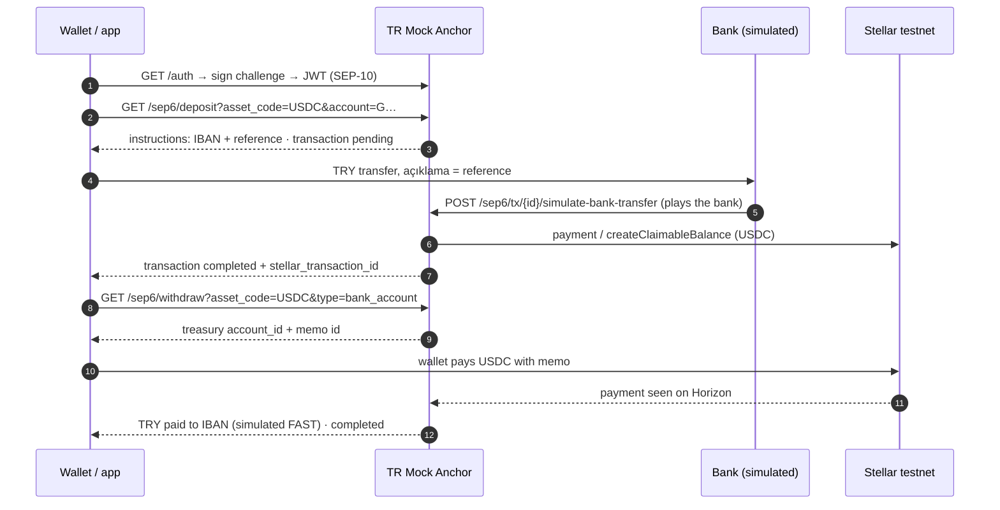

# TR Mock Anchor

**A mock Turkish TRY ⇄ USDC on/off-ramp on Stellar testnet, for builders who need to integrate a TRY ramp before a production anchor exists.** The one door is the standard, portable **SEP path** (SEP-1, SEP-10, SEP-6, SEP-12, SEP-38): integrate it once here, then move to any real SEP anchor by changing only the network and the home domain. The bank, KYC and payout legs are simulated; the Stellar leg is real testnet USDC.

Live sandbox: **https://tr-mock-anchor.fly.dev**

| | |
| --- | --- |
| 🏠 [Home](https://tr-mock-anchor.fly.dev/) | What the anchor is, live status, on/off-ramp at a glance |
| 🧭 [The SEP path](https://tr-mock-anchor.fly.dev/sep) | **Start here.** The portable integration guide (SEP-1/10/6/12/38) |
| ▶️ [SEP demo](https://tr-mock-anchor.fly.dev/explorer) | Run the SEP flow live in your browser, no wallet app |
| 📖 [Guide](https://tr-mock-anchor.fly.dev/guide) | Concepts, Turkish rails, flows, SEP-6 door, statuses, glossary (TR/EN) |
| 🚀 [Mainnet: what to expect](https://tr-mock-anchor.fly.dev/mainnet) | What changes in production (real KYC, real bank rails, live pricing) + a readiness checklist |
| 🤖 [llms.txt](https://tr-mock-anchor.fly.dev/llms.txt) · [llms-full.txt](https://tr-mock-anchor.fly.dev/llms-full.txt) · [sitemap.md](https://tr-mock-anchor.fly.dev/sitemap.md) · [/health](https://tr-mock-anchor.fly.dev/health) · [stellar.toml](https://tr-mock-anchor.fly.dev/.well-known/stellar.toml) | For agents, wallets and monitors |

> **TL;DR (TR):** Türkiye'deki borsaların onramp/offramp akışını taklit eden, Stellar testnet üzerinde çalışan bir
> mock anchor. Tek kapı standart **SEP yoludur** (SEP-1/10/6/12/38). Kullanıcı kendi Stellar anahtarıyla giriş
> yapar (SEP-10); KYC simüledir ve kişisel veri istemez (SEP-12). TL banka transferi *simüle* edilir
> (açıklamaya referans kodu yazma mantığıyla), TL bakiyesi USD/TRY kuruna göre USDC'ye çevrilir ve **gerçek testnet
> USDC** kullanıcının Stellar adresine gönderilir. Offramp tam tersi: memo ile USDC gönder, TL bakiyesi oluşur,
> IBAN'a ödeme simüle edilir. Banka, KYC ve ödeme sahte; Stellar tarafı gerçek.

<p align="center">
  <a href="docs/sep6-tx.png"></a>
  <a href="docs/landing.png"></a>
  <a href="docs/guide.png"></a>
</p>

## Contents

- [Why this exists](#why-this-exists)
- [What is real and what is simulated](#what-is-real-and-what-is-simulated)
- [How a Turkish ramp works (and how the mock mirrors it)](#how-a-turkish-ramp-works-and-how-the-mock-mirrors-it)
- [Quickstart](#quickstart)
- [The SEP surface](#the-sep-surface)
- [Testing the full flow](#testing-the-full-flow)
- [Statuses and errors](#statuses-and-errors)
- [Pricing](#pricing)
- [Stellar details](#stellar-details)
- [Architecture](#architecture)
- [Running locally](#running-locally)
- [Configuration](#configuration)
- [Deployment](#deployment)
- [Operating the sandbox](#operating-the-sandbox)
- [Security notes](#security-notes)
- [Limitations](#limitations)
- [Sandbox → production: what will change](#sandbox--production-what-will-change)
- [Project layout](#project-layout)
- [License](#license)

## Why this exists

No production Turkish anchor exists yet. This sandbox fills the gap with the standard, portable **SEP path**
(SEP-1/10/6/12/38): integrate it once against this mock and the same code moves to any real SEP anchor by
changing only the network and the home domain — everything else is discovered from the anchor's `stellar.toml`.
The whole handoff is two values: the home domain `tr-mock-anchor.fly.dev` and the asset `USDC`. Any Stellar
wallet or SDK can then discover the anchor and ramp with no custom code.

This anchor speaks **SEP-6**, the programmatic flow where your app owns the deposit/withdraw UI — not SEP-24's
anchor-hosted popup. The bank, KYC and payout legs are simulated so the whole loop runs in seconds without moving
lira; the Stellar settlement is real testnet USDC. The [/sep](https://tr-mock-anchor.fly.dev/sep) page is the
full walkthrough, and [/explorer](https://tr-mock-anchor.fly.dev/explorer) runs it live in the browser.

## What is real and what is simulated

| Piece | Status | Detail |
| --- | --- | --- |
| USDC paid to wallets on on-ramp | **Real (testnet)** | Payment from the treasury, or a claimable balance when the wallet is unfunded / has no trustline |
| USDC deposits detected on off-ramp | **Real (testnet)** | Horizon payments watcher, matched by memo id or muxed id |
| Rates | **Real, indicative** | USD/TRY from Reflector's FX oracle on Stellar mainnet, plus a flat spread; static fallback |
| Balances, ledger, SEP-38 quotes | **Real logic** | Fixed-point money math, append-only ledger, SEP-38 firm quotes |
| SEP-10 auth, SEP-6/12/38 protocol surface | **Real** | Verified with SDF's anchor-tests; usable from the Stellar demo wallet |
| Incoming TRY bank transfers | *Simulated* | `POST /sep6/tx/{id}/simulate-bank-transfer` plays the bank; the `more_info_url` page has a button |
| TRY payouts to IBANs | *Simulated* | Instant record with a FAST-style bank reference |
| KYC | *Simulated* | SEP-12: `NEEDS_INFO` until any `PUT`, then `ACCEPTED`; no personal data required, identity numbers are never stored |

## How a Turkish ramp works (and how the mock mirrors it)

1. **Log in.** The user signs a SEP-10 challenge with their Stellar key. There is no signup and no password; the
   key is the identity. → `GET /auth` then `POST /auth`.
2. **Start a deposit.** The anchor returns SEP-9 bank instructions: its IBAN and a personal `external_transfer_memo`
   (reference) to write in the transfer description (*açıklama*). → `GET /sep6/deposit`.
3. **Bank transfer with a reference.** In real life the user sends TRY by FAST/EFT/Havale with that reference. In
   the sandbox you play the bank. → `POST /sep6/tx/{id}/simulate-bank-transfer`.
4. **Buy USDC.** The anchor locks the rate (a SEP-38 `quote_id` if attached, else live), debits TRY and pays
   **real testnet USDC** on Stellar (payment, or claimable balance without a trustline). Poll to `completed`. →
   `GET /sep6/transaction`.
5. **Off-ramp.** The reverse: the user starts a withdrawal, gets the treasury address + a memo id, sends USDC with
   that memo; the anchor sells it for TRY and pays the IBAN. → `GET /sep6/withdraw`.



## Quickstart

The whole flow is what a wallet or dApp does. Watch it run at [/explorer](https://tr-mock-anchor.fly.dev/explorer),
drive it from [demo-wallet.stellar.org](https://demo-wallet.stellar.org) with home domain `tr-mock-anchor.fly.dev`,
or make the raw calls yourself:

```bash
export BASE=https://tr-mock-anchor.fly.dev
export G=G...            # your testnet account public key

# 1) SEP-1 — discover every endpoint from the signboard
curl -s $BASE/.well-known/stellar.toml

# 2) SEP-10 — get a challenge, sign it with your key, exchange it for a JWT
curl -s "$BASE/auth?account=$G"
# → {"transaction":"<challenge XDR>", ...}
# sign the returned transaction with your key (stellar-sdk, Lab, or the demo wallet), then:
curl -s -X POST $BASE/auth -H 'content-type: application/json' \
  -d '{"transaction":"<signed challenge XDR>"}'
# → {"token":"<JWT>"}
export JWT=...

# 3) SEP-6 — start a deposit (TRY → USDC); returns bank instructions (IBAN + reference)
curl -s -H "Authorization: Bearer $JWT" \
  "$BASE/sep6/deposit?asset_code=USDC&account=$G&amount=200&funding_method=bank_account"
# → {"id":"sep_...","instructions":{...},"how":"...","fee_percent":0.5, ...}

# 4) play the bank (sandbox only): the TRY "arrives" with the reference
curl -s -X POST "$BASE/sep6/tx/<ID>/simulate-bank-transfer" \
  -H 'content-type: application/json' -d '{"amount":"200.00"}'

# 5) poll to completion — the anchor pays real testnet USDC to your wallet
curl -s -H "Authorization: Bearer $JWT" "$BASE/sep6/transaction?id=<ID>"
# → status walks to "completed" with stellar_transaction_id (and claimable_balance_id if no trustline)

# 6) SEP-6 — withdraw (USDC → TRY): returns the treasury address + a memo id
curl -s -H "Authorization: Bearer $JWT" \
  "$BASE/sep6/withdraw?asset_code=USDC&type=bank_account&amount=4.08"
# → {"account_id":"G<treasury>","memo_type":"id","memo":"..."}
# send USDC to that address with that memo, then poll /sep6/transaction to "completed"
```

To receive USDC as a plain payment your account needs an XLM balance and a USDC trustline; without one you get a
claimable balance to claim after adding the trustline. Testnet USDC for your own wallet:
[faucet.circle.com](https://faucet.circle.com) → Stellar Testnet.

## The SEP surface

The whole handoff is two values — home domain `tr-mock-anchor.fly.dev` and asset `USDC`; everything else is
discovered from `stellar.toml`. Any wallet or SDK that speaks the SEPs can use this anchor with no custom code.

| SEP | Where | What it does here |
| --- | --- | --- |
| [SEP-1](https://github.com/stellar/stellar-protocol/blob/master/ecosystem/sep-0001.md) | `/.well-known/stellar.toml` | Publishes `TRANSFER_SERVER`, `WEB_AUTH_ENDPOINT`, `KYC_SERVER`, `ANCHOR_QUOTE_SERVER`, `SIGNING_KEY`, the USDC currency |
| [SEP-10](https://github.com/stellar/stellar-protocol/blob/master/ecosystem/sep-0010.md) | `/auth` | Challenge signed by `SIGNING_KEY`; verifies client signatures against the account's signers and medium threshold (unfunded accounts: master key), `memo` and `client_domain` supported; returns a JWT (`sub` = `G…`, `G…:memo` or `M…`) |
| [SEP-12](https://github.com/stellar/stellar-protocol/blob/master/ecosystem/sep-0012.md) | `/sep12` | **Simulated KYC.** A new wallet user is `NEEDS_INFO` with only *optional* fields; any `PUT /customer` (even `{}`) makes them `ACCEPTED`. Optional name/email/IBAN are kept; `tax_id`, `id_number`, birth dates and documents are dropped, never stored. Memos separate users on one account; `DELETE` forgets |
| [SEP-6](https://github.com/stellar/stellar-protocol/blob/master/ecosystem/sep-0006.md) | `/sep6` | `deposit` returns SEP-9 `instructions` (`bank_name`, `bank_account_number` = IBAN, `external_transfer_memo` = reference); `withdraw` returns the treasury `account_id` + `memo` (type id); `deposit-exchange` / `withdraw-exchange` accept a SEP-38 `quote_id`; `transactions` / `transaction` with `kind`, `limit`, `no_older_than`, `paging_id`, lookups by `id`, `stellar_transaction_id`, `external_transaction_id`; `on_change_callback` with an Ed25519 `Signature` header. Sandbox helpers: `GET /sep6/tx/{id}` (more_info_url) and `POST /sep6/tx/{id}/simulate-bank-transfer` |
| [SEP-38](https://github.com/stellar/stellar-protocol/blob/master/ecosystem/sep-0038.md) | `/sep38` | `iso4217:TRY` ⇄ `stellar:USDC:<issuer>`; indicative `/info`, `/prices`, `/price` and firm `/quote` (JWT, 15 min default, up to 1 h) that satisfy the SEP-38 price formulas; the fee (our spread) is expressed in the sell asset |

**The bank is still simulated.** A SEP-6 deposit sits in `pending_user_transfer_start` until the TRY "arrives":
open the transaction's `more_info_url` (`/sep6/tx/{id}`) and press *Simulate incoming TRY transfer*, or
`POST /sep6/tx/{id}/simulate-bank-transfer {"amount":"150.00"}`. The anchor then credits the user and pays
**real testnet USDC** to the wallet (payment, or claimable balance without a trustline). Withdrawals are real from
the first step: the wallet pays USDC with the memo, the watcher sees it on Horizon, TRY is credited and "paid out"
to the user's sandbox IBAN (or the IBAN they sent via SEP-12).

### Try it with a wallet

1. Open [demo-wallet.stellar.org](https://demo-wallet.stellar.org), create/fund a testnet account.
2. *Add asset* → home domain `tr-mock-anchor.fly.dev`, asset `USDC` (the wallet reads the toml and offers SEP-6).
3. **Deposit**: the wallet shows the bank instructions; open the transaction's *more info* link and press the
   simulate button; USDC lands in the wallet within seconds.
4. **Withdraw**: the wallet pays USDC to the treasury with the memo; the transaction completes and shows the
   TRY payout reference.

## Testing the full flow

Ways to exercise a complete TRY ⇄ USDC round trip, from no-code to CLI:

| # | Where | What it does | Needs |
| --- | --- | --- | --- |
| 1 | **[/explorer](https://tr-mock-anchor.fly.dev/explorer)** — the SEP demo page | Runs the SEP flow live in the browser, no wallet app needed. Shows every request/response and links each real testnet tx. `?autorun=1` starts it automatically. | Nothing |
| 2 | **[demo-wallet.stellar.org](https://demo-wallet.stellar.org)** — a real Stellar wallet | Create/fund a testnet account → *Add asset* `USDC` with home domain `tr-mock-anchor.fly.dev` → **SEP-6 Deposit** (open the transaction's *more info* link, press *Simulate incoming TRY transfer*) → USDC arrives → **SEP-6 Withdraw** (wallet pays USDC with the memo) → TRY payout. | A testnet wallet |
| 3 | **curl** | The [Quickstart](#quickstart) sequence: stellar.toml → SEP-10 → SEP-6 deposit → simulate → poll → SEP-6 withdraw. | A testnet key + a signer |
| 4 | **CLI / CI** (below) | Scripted end-to-end and protocol-conformance runs against any deployment. | Node ≥ 22.13, a clone |

```bash
npm test                 # vitest: money math, IBAN/TCKN, SEP-10/6/12/38 flow (in-memory DB + fake Stellar)
npm run typecheck
# against a RUNNING server on real testnet:
BASE_URL=https://tr-mock-anchor.fly.dev npm run e2e:sep6    # SEP flow: SEP-10 → SEP-12 → deposit (simulated bank) → SEP-38 quote → withdraw, on-chain
HOME_DOMAIN=https://tr-mock-anchor.fly.dev npm run sep:conformance   # SDF anchor-tests for SEP-1/10/12/6/38
```

- `npm run e2e:sep6` drives the whole SEP flow from Node against a running server on real testnet: toml →
  SEP-10 → SEP-12 → deposit (simulated bank, on-chain USDC asserted via Horizon) → SEP-38 quote →
  withdraw-exchange (USDC paid back with the memo) → completed with payout.
- `npm run sep:conformance` runs SDF's [`@stellar/anchor-tests`](https://github.com/stellar/stellar-anchor-tests)
  for SEP-1, 10, 12, 6 and 38 against the deployment (`HOME_DOMAIN=http://localhost:8787 npm run sep:conformance`
  for a local server). Config in `anchor-tests.config.json`. The skipped tests only apply to anchors that run
  SEP-6 without authentication.

## Statuses and errors

- **SEP-6 status walk:** `pending_user_transfer_start` (waiting for the TRY transfer, or for the USDC payment with
  the memo) → `pending_anchor` (TRY received, paying USDC; also while the treasury is low) → `pending_stellar`
  (retrying a submit) → `completed`. Failures are `error` with `refunds` when TRY was returned to the balance.
- **Amounts:** `amount_in` / `amount_out` with their `_asset` fields, `amount_fee` (the spread, in TRY) and
  `fee_details`. Timestamps are ISO 8601. `more_info_url` is the human page for the transaction. On completion a
  deposit carries `stellar_transaction_id` (and `claimable_balance_id` if no trustline); a withdrawal carries
  `external_transaction_id` = the payout's bank reference.
- **Errors** are JSON. SEP-10 failures are HTTP 400 with `{"error"}`; missing tokens on protected endpoints are
  HTTP 403 `{"type":"authentication_required"}`. SEP-38 quotes obey the price formulas and are single-use and
  bound to the authenticated user.
- **Callbacks:** pass `on_change_callback=https://…` on deposit/withdraw and the anchor POSTs `{"transaction": …}`
  on every status change with a `Signature: t=<unix>, s=<base64>` header — an Ed25519 signature by `SIGNING_KEY`
  over `"<t>.<your host>.<body>"`.

## Pricing

The anchor treats USDC as 1 USD and prices **USDC/TRY** off the **USD/TRY mid rate** read from Reflector's FX
oracle on Stellar **mainnet** (contract `CBKGPWGKSKZF52CFHMTRR23TBWTPMRDIYZ4O2P5VS65BMHYH4DXMCJZC`, via
`simulateTransaction`, cached 60 s). A flat spread (`SPREAD_BPS`, default 50) is applied on each side:
`buy_rate = mid × (1 + spread)`, `sell_rate = mid × (1 − spread)`. There are no fixed fees, so a full round trip
costs ≈ 1 %. A SEP-38 quote locks a firm rate (15 min default, up to 1 h) and can be passed to a SEP-6 deposit or
withdraw; without one, the leg prices at the live rate. If the oracle is unreachable the service falls back to
`STATIC_USDTRY` and reports `rate_source: "static_fallback"`. Live numbers are in `GET /health`.

## Stellar details

| | |
| --- | --- |
| Network | Testnet — `Test SDF Network ; September 2015` |
| Horizon | `https://horizon-testnet.stellar.org` |
| Endpoints | Submission + treasury sequence via **Stellar RPC** (`soroban-testnet.stellar.org`); incoming-payment watcher via **Horizon** (RPC has no per-account payment history) |
| Asset | `USDC` issued by Circle's testnet issuer `GBBD47IF6LWK7P7MDEVSCWR7DPUWV3NY3DTQEVFL4NAT4AQH3ZLLFLA5` (authoritative: `GET /health`) |
| Treasury | Pays every on-ramp, receives every off-ramp; address and balance in `GET /health` |
| Off-ramp routing | `memo_type: id` (12-digit id) or a muxed `M…` address with that id |
| First-time wallets | No account / no trustline → claimable balance with the destination as sole unconditional claimant |
| stellar.toml | SEP-1 at `/.well-known/stellar.toml`; publishes the SEP endpoints and signing key. SEP-24 (hosted UI) and SEP-31 are not implemented — SEP-6 is the programmatic door |

## Architecture

```
                 ┌──────────────── Hono (Node 24) ────────────────┐
 browser ──────▶ │ pages  /  /sep  /explorer  /guide  /mainnet     │
 wallets ──────▶ │ /auth /sep6 /sep12 /sep38 (SEP-10 JWT)  ─┐      │
                 │ /.well-known/stellar.toml (SEP-1)         ├─▶ routes ─▶ core
                 │ /health                                   │   (ledger, events,
                 └───────────────────────────────┬──────────┘    orders, sep)     │
                                                  ▼           ▼
                                             node:sqlite   workers (loops)
                                             (WAL, one     ├─ settleOnramps ─▶ RPC: payment / claimable balance
                                              file)        ├─ watchOfframps ◀─ Horizon: payments to treasury (cursor persisted)
                                                           └─ sepCallbacks  ─▶ wallet on_change_callback (Ed25519 Signature)
                                             rates ◀── Reflector FX oracle (mainnet RPC, simulateTransaction) / static
```

- **One process, one SQLite file.** All writes go through `tx()`; balance changes are ledger entries written in the
  same transaction as the state change and the event they emit.
- **Money is bigint fixed-point.** Kuruş for TRY, stroops for USDC, micro-units for rates. Conversions floor toward
  the anchor; "solve for the source amount" variants ceil.
- **Stellar is behind an interface** (`StellarGateway`) with a live Horizon/RPC implementation and an in-memory
  fake, so the whole surface can be tested offline (`STELLAR_MODE=fake`).
- **Nothing throws after a transaction is submitted.** Post-submit lookups (claimable balance id via Horizon
  effects) are best-effort, so a retry can never pay twice.
- **Wallet users** live under a built-in partner, one customer per SEP-10 subject; a memo separates users that
  share an account.
- **SEP transactions link to an on-ramp or off-ramp** (`sep_transactions`); the SEP status is derived from the
  order, so the human page, the callback and the API can never disagree.

## Running locally

Requires Node ≥ 22.13 (uses the built-in `node:sqlite`; no native dependencies).

```bash
npm install
cp .env.example .env
npm run setup:treasury          # creates a testnet account + USDC trustline, prints TREASURY_SECRET
# paste TREASURY_SECRET into .env, then fund the treasury (see "Operating the sandbox")
npm run dev                     # http://localhost:8787 — /, /sep, /explorer, /guide, /mainnet and the SEP endpoints
```

Offline / CI: `STELLAR_MODE=fake RATE_SOURCE=static npm run dev` runs with an in-memory chain, so tests and demos
work without Horizon.

## Configuration

All settings are environment variables (see `.env.example`).

| Variable | Default | Purpose |
| --- | --- | --- |
| `PORT`, `PUBLIC_URL` | `8787`, `http://localhost:8787` | Listening port; public origin used in `stellar.toml` |
| `DB_PATH` | `./data/anchor.db` | SQLite file (`:memory:` allowed) |
| `STELLAR_MODE` | `live` | `live` = Horizon/RPC testnet, `fake` = in-memory chain |
| `HORIZON_URL`, `RPC_URL`, `NETWORK_PASSPHRASE` | testnet | Stellar network endpoints |
| `USDC_ISSUER` | Circle testnet issuer | Asset issuer; point at a self-issued asset for load tests |
| `TREASURY_SECRET` | — | Treasury signing key (required in live mode) |
| `RATE_SOURCE`, `STATIC_USDTRY` | `reflector`, `47.50` | Rate source and fallback |
| `SPREAD_BPS`, `QUOTE_TTL_SECONDS`, `OFFRAMP_RATE_LOCK_SECONDS` | `50`, `120`, `1800` | Pricing behaviour |
| `MIN_ONRAMP_TRY`, `MAX_ONRAMP_TRY`, `MIN_OFFRAMP_USDC` | `50.00`, `3000.00`, `1.0000000` | Order limits (per on-ramp cap keeps the shared testnet treasury from draining) |
| `BANK_NAME`, `ACCOUNT_HOLDER` | mock bank identity | Shown in SEP-6 deposit instructions |
| `ANCHOR_SIGNING_SECRET` | auto-generated, persisted in DB | SEP-1 `SIGNING_KEY` / SEP-10 server key / callback signatures. Set it to keep the published key stable across databases |
| `JWT_SECRET` | auto-generated, persisted in DB | Signs SEP-10 JWTs |
| `ADMIN_USER`, `ADMIN_PASSWORD` | — | Enable the read-only `/admin` data viewer (HTTP Basic); disabled unless both are set |
| `WORKERS` | `true` | Background settlement loops (set `false` to run the API only) |

## Deployment

The service is one Node process with a SQLite file and background workers, so it wants a host that keeps a single
instance running on a persistent disk. The live sandbox runs on Fly.io from the included `Dockerfile` and `fly.toml`
(single machine, 1 GB volume at `/data`, `auto_stop_machines = "off"` so the workers keep running):

```bash
fly apps create tr-mock-anchor
fly volumes create anchor_data --region fra --size 1 --app tr-mock-anchor
fly secrets set TREASURY_SECRET=S... --app tr-mock-anchor --stage
fly deploy --app tr-mock-anchor --ha=false
```

Set `PUBLIC_URL` in `fly.toml` to the public origin. Redeploys are `fly deploy --app tr-mock-anchor --ha=false`.
Any Docker host with a persistent volume works the same way (`docker build -t tr-mock-anchor . && docker run -p 8787:8787 -v anchor:/data --env-file .env tr-mock-anchor`).

## Operating the sandbox

**Funding the treasury.** On-ramps pay USDC out of the treasury and off-ramps pay it back, so usage roughly recycles
the same pool. To add Circle-issued testnet USDC:

- Send any amount to the treasury address (in `GET /health`) from a wallet that holds testnet USDC.
- Or use [Circle's faucet](https://faucet.circle.com) → *Stellar Testnet* → treasury address: **20 USDC per address
  every 2 hours** (reCAPTCHA, no login). Request to several helper accounts and consolidate with
  `SWEEP_SECRETS=S...,S... npm run sweep`. Circle's Discord handles larger requests.
- For load tests where wallets don't need Circle's issuer, `npm run mock:usdc` issues a self-controlled `USDC` on
  testnet and mints 1,000,000 to the treasury; run the anchor with that `USDC_ISSUER`.

**Monitoring.** `GET /health` reports treasury balance (`low_balance` below 100 USDC), rate source and mode. On-ramps
never fail for lack of funds — they wait with `pending_reason: "treasury_low"` and settle when funds arrive. Logs:
`fly logs --app tr-mock-anchor`. When `ADMIN_USER`/`ADMIN_PASSWORD` are set, `/admin` is a read-only data viewer.

**Data.** Everything lives in the SQLite file on the volume (Fly snapshots it daily). Wiping it resets all users and
orders; the treasury and its on-chain history are unaffected.

## Security notes

- This is a **testnet sandbox**. It moves no real money.
- The SEP path is **non-custodial**: the user's Stellar key is the identity, signs SEP-10, and signs the off-ramp
  payment. There is no API key and no password to protect.
- SEP-10 JWTs are signed with `JWT_SECRET`; the SEP-1 signing key and JWT secret are generated once and kept in the
  database unless pinned via env.
- The treasury secret lives only in the server's environment (`.env` locally, Fly secrets in production).
- CORS is open (`*`) so browser wallets and prototypes can call the SEP endpoints directly.
- SEP-12 never stores identity numbers, birth dates or documents, even if a wallet sends them.

## Limitations

- No real bank, KYC, compliance, or payout rails. The bank is you.
- Single treasury and single process: settlement is sequential (a few seconds per on-ramp).
- Off-ramp detection polls Horizon every 5 s and matches only `memo_type: id` or muxed ids.
- Rates are indicative; the spread is a flat number, not an order book.
- A shared sandbox may be reset. Do not build anything that depends on its data persisting.

## Sandbox → production: what will change

You built on the SEP path, so moving to a real anchor changes only the **network** (passphrase + Horizon/RPC URLs)
and the **home domain**; the SEP-1/10/6/12/38 endpoint shapes are re-discovered from the new anchor's
`stellar.toml` and your integration code stays the same. The one dependency: the mainnet anchor must implement
**SEP-6**. Behind that same surface, the anchor makes real what this sandbox simulates:

- **Real KYC and compliance** through SEP-12: real identity verification, KYC tiers that set limits, travel-rule
  originator info, purpose / source of funds, possibly pre-registered addresses and bank accounts.
- **Real bank rails:** the `simulate-bank-transfer` helper disappears; a real TRY transfer credits the deposit.
- **Live pricing** through SEP-38: quotes from a real order book, shorter TTLs, fees as line items.
- **Limits and operations:** per-tier limits, rate limits (HTTP 429), maintenance windows, delayed settlement.
- **Mainnet money:** USDC's mainnet issuer is `GA5ZSEJYB37JRC5AVCIA5MOP4RHTM335X2KGX3IHOJAPP5RE34K4KZVN`;
  trustlines, treasury addresses and explorers change.

The dedicated page [Mainnet: what to expect](https://tr-mock-anchor.fly.dev/mainnet) has the full list, a
sandbox-step → production-equivalent mapping table, and a persistent readiness checklist.

## Project layout

```
src/
  index.ts, server.ts, app.ts    bootstrap, Hono app, error handling
  config.ts                      env → typed config
  context.ts, errors.ts, validate.ts, ids.ts   request context, error types, input validation, id helpers
  db.ts                          node:sqlite schema, tx() helper, kv
  money.ts                       bigint fixed-point TRY/USDC/rate math
  turkey.ts                      TR IBAN (mod-97), TCKN checksum, deposit references
  rates.ts                       Reflector oracle client, cache, spread, static fallback
  stellar.ts                     StellarGateway: live Horizon/RPC implementation + in-memory fake
  workers.ts                     on-ramp settlement, off-ramp watcher, SEP on_change_callback delivery
  jwt.ts, sepauth.ts             SEP-10 JWT signing + SEP auth middleware
  sep7.ts                        SEP-7 payment URI helper
  routes/                        sep10, sep6, sep12, sep38, public, admin (read-only data viewer + sandbox helpers)
  core/                          ledger, events, orders, serialize, sep, sepstatus, partners (SEP wallet users), types
public/                          index (home), sep (SEP path guide), explorer (SEP demo), guide, mainnet, site.js, style.css
scripts/                         setup-treasury, issue-mock-usdc, sweep, e2e-sep6
anchor-tests.config.json         SDF anchor-tests configuration
test/                            vitest suites
docs/                            screenshots
Dockerfile, fly.toml             deployment
```

## License

[MIT](LICENSE). TR Mock Anchor is not a bank, an exchange or a licensed payment institution, and it moves no real money.
