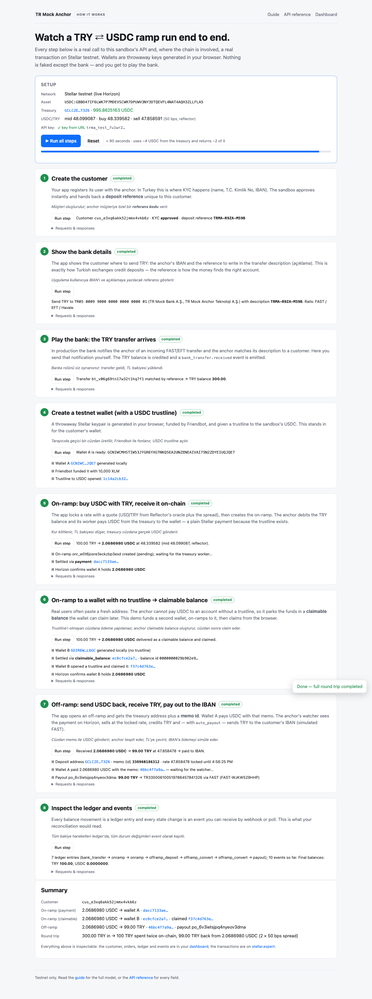
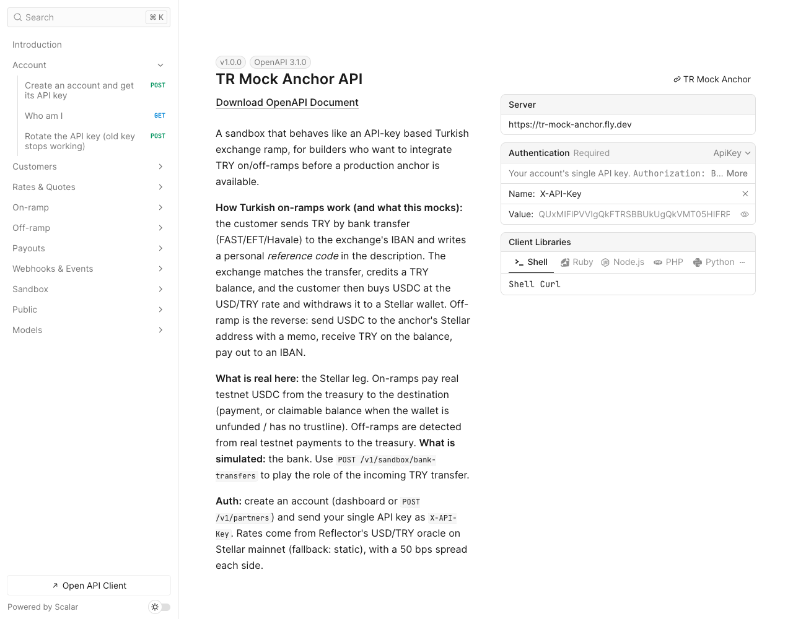
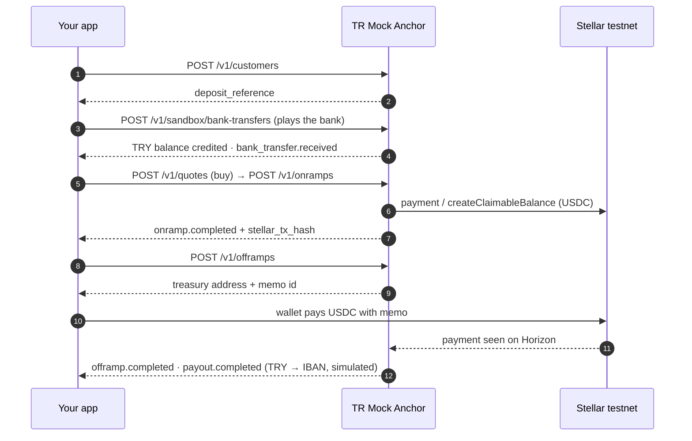

# TR Mock Anchor

**A mock Turkish TRY ⇄ USDC on/off-ramp on Stellar testnet, for builders who need to integrate a TRY ramp before a production anchor exists.** Two doors, one ledger: a partner-style **API-key REST API** (how Turkish exchanges expose ramps) and a standards-compliant **SEP-6 door** for wallets (SEP-1, SEP-10, SEP-12, SEP-38).

Live sandbox: **https://tr-mock-anchor.fly.dev**

| | |
| --- | --- |
| 🏠 [Home / sign up](https://tr-mock-anchor.fly.dev/) | Create an account with your email, get your single API key |
| ▶️ [How it works](https://tr-mock-anchor.fly.dev/demo) | Runs the whole round trip live in your browser: throwaway wallets, real testnet transactions |
| 📖 [Guide](https://tr-mock-anchor.fly.dev/guide) | Concepts, Turkish rails, flows, statuses, errors, webhooks, glossary (TR/EN) |
| 🚀 [Mainnet: what to expect](https://tr-mock-anchor.fly.dev/mainnet) | What changes in production (auth, swap-based ramps, compliance) + a readiness checklist |
| 🧾 [API reference](https://tr-mock-anchor.fly.dev/docs) | Interactive OpenAPI 3.1 ([raw spec](https://tr-mock-anchor.fly.dev/openapi.json)) |
| 🎛 [Dashboard](https://tr-mock-anchor.fly.dev/dashboard) | Your key, a playground, live tables of customers / orders / events |
| 🤖 [llms.txt](https://tr-mock-anchor.fly.dev/llms.txt) · [stellar.toml](https://tr-mock-anchor.fly.dev/.well-known/stellar.toml) · [/health](https://tr-mock-anchor.fly.dev/health) | For agents, wallets and monitors |

> **TL;DR (TR):** Türkiye'deki borsaların onramp/offramp akışını taklit eden, Stellar testnet üzerinde çalışan bir
> mock anchor. Kullanıcı e-postasıyla kaydolur, tek bir API key alır. TL banka transferi *simüle* edilir
> (açıklamaya referans kodu yazma mantığıyla), TL bakiyesi USD/TRY kuruna göre USDC'ye çevrilir ve **gerçek testnet
> USDC** kullanıcının Stellar adresine gönderilir. Offramp tam tersi: memo ile USDC gönder, TL bakiyesi oluşur,
> IBAN'a ödeme simüle edilir. Banka, KYC ve ödeme sahte; Stellar tarafı gerçek.

<p align="center"></p>
<p align="center">
  <a href="docs/sep6-tx.png"></a>
  <a href="docs/landing.png"></a>
  <a href="docs/guide.png"></a>
  <a href="docs/apidocs.png"></a>
</p>

## Contents

- [Why this exists](#why-this-exists)
- [What is real and what is simulated](#what-is-real-and-what-is-simulated)
- [How a Turkish ramp works (and how the mock mirrors it)](#how-a-turkish-ramp-works-and-how-the-mock-mirrors-it)
- [Quickstart](#quickstart)
- [The interactive demo](#the-interactive-demo)
- [API overview](#api-overview)
- [SEP-6 door for wallets](#sep-6-door-for-wallets)
- [Statuses, errors and events](#statuses-errors-and-events)
- [Pricing](#pricing)
- [Stellar details](#stellar-details)
- [Architecture](#architecture)
- [Running locally](#running-locally)
- [Testing the full flow](#testing-the-full-flow)
- [Configuration](#configuration)
- [Deployment](#deployment)
- [Operating the sandbox](#operating-the-sandbox)
- [Security notes](#security-notes)
- [Limitations](#limitations)
- [Project layout](#project-layout)
- [License](#license)

## Why this exists

Turkish exchanges and payment institutions expose fiat ramps to partners through **API-key based REST APIs**: the
integrator owns the customer UI, holds a key, and drives the journey (register customer → show bank details → detect
deposit → convert → pay out on-chain). That is a different shape from the wallet-initiated SEP-24 / SEP-6 flows the
Stellar test anchor implements, and it is the shape hackathon and pilot builders will meet when a production
Turkish anchor launches.

This project gives them something to build against today: the same shape, the same vocabulary, real Stellar
settlement — and a simulated bank so the whole loop can be exercised in seconds without moving lira.

## What is real and what is simulated

| Piece | Status | Detail |
| --- | --- | --- |
| USDC paid to wallets on on-ramp | **Real (testnet)** | Payment from the treasury, or a claimable balance when the wallet is unfunded / has no trustline |
| USDC deposits detected on off-ramp | **Real (testnet)** | Horizon payments watcher, matched by memo id or muxed id |
| Rates | **Real, indicative** | USD/TRY from Reflector's FX oracle on Stellar mainnet, plus a flat spread; static fallback |
| Balances, ledger, quotes, orders, events, webhooks | **Real logic** | Fixed-point money math, append-only ledger, HMAC-signed webhooks with retries |
| Incoming TRY bank transfers | *Simulated* | `POST /v1/sandbox/bank-transfers` plays the bank; unknown references are held as `unmatched` |
| TRY payouts to IBANs | *Simulated* | Instant record with a FAST-style bank reference |
| KYC | *Simulated* | Partner API: instant approval; magic first names `REJECT` / `PENDING`; TCKN and IBAN checksums validated. SEP-12: `NEEDS_INFO` until any `PUT`, then `ACCEPTED`; no personal data required, identity numbers are never stored |

## How a Turkish ramp works (and how the mock mirrors it)

1. **Customer + KYC.** The app registers its user with the anchor (name, T.C. Kimlik No, IBAN). → `POST /v1/customers`
   returns `kyc_status` and a personal `deposit_reference` like `TRMA-7K2M-Q9XZ`.
2. **Bank transfer with a reference.** The customer sends TRY by FAST/EFT/Havale to the anchor's IBAN and writes the
   reference in the description (*açıklama*). → `GET /v1/customers/{id}/deposit-instructions` gives the app exactly
   what to show; `POST /v1/sandbox/bank-transfers` is the bank telling the anchor the money arrived.
3. **TRY balance.** The anchor matches the reference and credits the customer. Unmatched transfers wait for support.
4. **Buy USDC.** The customer converts at the USD/TRY rate. → `POST /v1/quotes` (locks a rate for 120 s) then
   `POST /v1/onramps` (debits TRY, pays USDC on Stellar).
5. **Off-ramp.** The customer sends USDC to the anchor with a memo; the anchor sells it for TRY and pays the IBAN.
   → `POST /v1/offramps` returns the deposit address + memo id; the watcher does the rest; `auto_payout` pays out.



## Quickstart

1. Sign up at https://tr-mock-anchor.fly.dev with your email; copy the API key from the dashboard
   (or `POST /v1/partners {"email","password","name"}`).
2. Get a testnet wallet (Freighter on testnet, or [Stellar Lab](https://lab.stellar.org/account/create)), fund it with
   Friendbot. A trustline to the sandbox's USDC is optional — without it you receive a claimable balance.
3. Run the flow:

```bash
export BASE=https://tr-mock-anchor.fly.dev
export KEY=trma_test_...

# 1) customer -> deposit reference
curl -s -X POST $BASE/v1/customers -H "X-API-Key: $KEY" -H 'content-type: application/json' \
  -d '{"first_name":"Ayşe","last_name":"Yılmaz","tckn":"10000000146","iban":"TR330006100519786457841326"}'
# {"id":"cus_...","deposit_reference":"TRMA-7K2M-Q9XZ","kyc_status":"approved", ...}

# 2) what the customer sees in your app
curl -s $BASE/v1/customers/cus_.../deposit-instructions -H "X-API-Key: $KEY"

# 3) play the bank: the transfer arrives with the reference in its description
curl -s -X POST $BASE/v1/sandbox/bank-transfers -H "X-API-Key: $KEY" -H 'content-type: application/json' \
  -d '{"reference":"TRMA-7K2M-Q9XZ","amount_try":"1000.00","sender_name":"Ayşe Yılmaz"}'

# 4) lock a rate and on-ramp
curl -s -X POST $BASE/v1/quotes -H "X-API-Key: $KEY" -H 'content-type: application/json' \
  -d '{"customer_id":"cus_...","side":"buy","amount":"1000.00","amount_currency":"TRY"}'
curl -s -X POST $BASE/v1/onramps -H "X-API-Key: $KEY" -H 'content-type: application/json' \
  -d '{"customer_id":"cus_...","quote_id":"qt_...","destination_address":"G..."}'
# poll GET /v1/onramps/{id} until status = completed → settlement, stellar_tx_hash, claimable_balance_id

# 5) off-ramp: get an address + memo, send USDC on-chain from the wallet, poll
curl -s -X POST $BASE/v1/offramps -H "X-API-Key: $KEY" -H 'content-type: application/json' \
  -d '{"customer_id":"cus_...","amount_usdc":"5.0000000"}'
# {"deposit":{"address":"G<treasury>","memo_type":"id","memo":"482913005771"},"status":"awaiting_deposit"}
# -> completed: received_usdc, amount_try, payout_id
```

JavaScript and Python versions of the same flow are pre-filled with your key in the dashboard's *Quickstart* panel.

## The interactive demo

[`/demo`](https://tr-mock-anchor.fly.dev/demo) is the end-to-end test turned into a page. It runs eight steps
against the live API and Stellar testnet from your browser, showing every request and response and linking every
transaction to stellar.expert:

1. create the customer → 2. show the bank details → 3. play the bank (300 TRY arrives) → 4. generate a throwaway
wallet, Friendbot-fund it and open a USDC trustline → 5. quote + on-ramp 100 TRY, verify the wallet balance on
Horizon → 6. on-ramp 100 TRY to a second wallet **without** a trustline, receive a claimable balance and claim it
→ 7. off-ramp: the wallet pays the USDC back with the memo, the anchor converts and pays the IBAN → 8. read the
ledger and events.

It uses your dashboard session if you are logged in, or a pasted key, or a temporary demo account. The whole run
takes about a minute and consumes ~4 USDC from the shared treasury, ~2 of which come back. Append `?autorun=1` to
start automatically (handy for livestreams).

## API overview

Base path `/v1`. Auth header `X-API-Key: <key>` (or `Authorization: Bearer <key>`). All amounts are decimal
**strings** — TRY has 2 decimals, USDC 7, rates 6. Pagination: `limit` (1–200, default 50) and `offset`.

| Area | Endpoints |
| --- | --- |
| Account | `POST /partners` (signup, returns the key) · `GET /partners/me` · `POST /partners/me/rotate-key` |
| Customers | `POST/GET /customers` · `GET/PATCH /customers/{id}` · `GET /customers/{id}/deposit-instructions` · `/balances` · `/ledger` · `/bank-transfers` |
| Rates & quotes | `GET /rates` · `POST /quotes` · `GET /quotes/{id}` |
| On-ramp | `POST/GET /onramps` · `GET /onramps/{id}` |
| Off-ramp | `POST/GET /offramps` · `GET /offramps/{id}` · `POST /offramps/{id}/cancel` |
| Payouts | `POST/GET /payouts` · `GET /payouts/{id}` |
| Webhooks & events | `POST/GET /webhooks` · `DELETE /webhooks/{id}` · `GET /webhooks/{id}/deliveries` · `GET /events` |
| Sandbox | `POST/GET /sandbox/bank-transfers` · `POST /sandbox/bank-transfers/{id}/assign` · `POST /sandbox/customers/{id}/kyc` · `GET /sandbox/treasury` · `GET /sandbox/unmatched-deposits` · `POST /sandbox/usdc-deposits` (fake-Stellar mode only) |
| Public (no auth) | `GET /health` · `/openapi.json` · `/docs` · `/guide` · `/demo` · `/llms.txt` · `/.well-known/stellar.toml` |
| SEP-10 (wallets) | `GET/POST /auth` |
| SEP-6 (wallets, JWT) | `GET /sep6/info` · `/sep6/deposit` · `/sep6/deposit-exchange` · `/sep6/withdraw` · `/sep6/withdraw-exchange` · `/sep6/transactions` · `/sep6/transaction` · `GET /sep6/tx/{id}` (more_info_url) · `POST /sep6/tx/{id}/simulate-bank-transfer` (sandbox bank) |
| SEP-12 (wallets, JWT) | `GET/PUT /sep12/customer` · `PUT /sep12/customer/callback` · `DELETE /sep12/customer/{account}` |
| SEP-38 | `GET /sep38/info` · `/sep38/prices` · `/sep38/price` · `POST /sep38/quote` (JWT) · `GET /sep38/quote/{id}` (JWT) |

The full field-level reference is the OpenAPI document; the [guide](https://tr-mock-anchor.fly.dev/guide) explains
the model behind it.

## SEP-6 door for wallets

The same anchor is discoverable and usable by any Stellar wallet or SDK that speaks the SEPs. Nothing is
duplicated: SEP transactions are views over the same on-ramps, off-ramps, ledger and treasury as the partner API.

| SEP | Where | What it does here |
| --- | --- | --- |
| [SEP-1](https://github.com/stellar/stellar-protocol/blob/master/ecosystem/sep-0001.md) | `/.well-known/stellar.toml` | Publishes `TRANSFER_SERVER`, `WEB_AUTH_ENDPOINT`, `KYC_SERVER`, `ANCHOR_QUOTE_SERVER`, `SIGNING_KEY`, the USDC currency |
| [SEP-10](https://github.com/stellar/stellar-protocol/blob/master/ecosystem/sep-0010.md) | `/auth` | Challenge signed by `SIGNING_KEY`; verifies client signatures against the account's signers and medium threshold (unfunded accounts: master key), `memo` and `client_domain` supported; returns a JWT (`sub` = `G…`, `G…:memo` or `M…`) |
| [SEP-12](https://github.com/stellar/stellar-protocol/blob/master/ecosystem/sep-0012.md) | `/sep12` | **Simulated KYC.** A new wallet user is `NEEDS_INFO` with only *optional* fields; any `PUT /customer` (even `{}`) makes them `ACCEPTED`. Optional name/email/IBAN are kept; `tax_id`, `id_number`, birth dates and documents are dropped, never stored. Memos separate users on one account; `DELETE` forgets |
| [SEP-6](https://github.com/stellar/stellar-protocol/blob/master/ecosystem/sep-0006.md) | `/sep6` | `deposit` returns SEP-9 `instructions` (`bank_name`, `bank_account_number` = IBAN, `external_transfer_memo` = reference); `withdraw` returns the treasury `account_id` + `memo` (type id); `deposit-exchange` / `withdraw-exchange` accept SEP-38 `quote_id`; `transactions` / `transaction` with `kind`, `limit`, `no_older_than`, `paging_id`, lookups by `id`, `stellar_transaction_id`, `external_transaction_id`; `on_change_callback` with an Ed25519 `Signature` header |
| [SEP-38](https://github.com/stellar/stellar-protocol/blob/master/ecosystem/sep-0038.md) | `/sep38` | `iso4217:TRY` ⇄ `stellar:USDC:<issuer>`; indicative `/prices`, `/price` and firm `/quote` (15 min default, up to 1 h) that satisfy the SEP-38 price formulas; fee expressed in the sell asset |

**The bank is still simulated.** A SEP-6 deposit sits in `pending_user_transfer_start` until the TRY "arrives":
open the transaction's `more_info_url` (`/sep6/tx/{id}`) and press *Simulate incoming TRY transfer*, or
`POST /sep6/tx/{id}/simulate-bank-transfer {"amount":"150.00"}`. The anchor then credits the user and pays
**real testnet USDC** to the wallet (payment, or claimable balance without a trustline). Withdrawals are
real from the first step: the wallet pays USDC with the memo, the watcher sees it on Horizon, TRY is
credited and "paid out" to the user's sandbox IBAN (or the IBAN they sent via SEP-12).

Status mapping: `pending_user_transfer_start` (waiting for TRY / for the USDC payment) → `pending_anchor`
(TRY received, paying USDC; also `treasury_low`) → `pending_stellar` (retrying a submit) → `completed`.
Failures are `error` with `refunds` when TRY was returned to the balance. `amount_fee` is the spread in TRY.

### Try it with a wallet

1. Open [demo-wallet.stellar.org](https://demo-wallet.stellar.org), create/fund a testnet account.
2. *Add asset* → home domain `tr-mock-anchor.fly.dev`, asset `USDC` (the wallet reads the toml and offers SEP-6).
3. **Deposit**: the wallet shows the bank instructions; open the transaction's *more info* link and press the
   simulate button; USDC lands in the wallet within seconds.
4. **Withdraw**: the wallet pays USDC to the treasury with the memo; the transaction completes and shows the
   TRY payout reference.

### Conformance

- `npm run sep:conformance` runs SDF's [`@stellar/anchor-tests`](https://github.com/stellar/stellar-anchor-tests)
  for SEP-1, 10, 12, 6 and 38 against the deployment (`HOME_DOMAIN=http://localhost:8787 npm run sep:conformance`
  for a local server). Config in `anchor-tests.config.json`. Current result against production is in the
  [Testing the full flow](#testing-the-full-flow) section.
- `npm run e2e:sep6` drives the whole SEP flow from Node against a running server on real testnet: toml →
  SEP-10 → SEP-12 → deposit (simulated bank, on-chain USDC asserted via Horizon) → SEP-38 quote →
  withdraw-exchange (USDC paid back with the memo) → completed with payout. Last production run: deposit
  [f92c4c6d…](https://stellar.expert/explorer/testnet/tx/f92c4c6d055e720cc6436b069abe908517eec3a90783c863c4a5a156f697565f),
  withdrawal [437cd15e…](https://stellar.expert/explorer/testnet/tx/437cd15e10446bdbf43f6f74f55a35b8b29962efd97835bb269a41502e49ed24).

### Partner API vs SEP door

| | Partner API (`/v1`) | SEP door |
| --- | --- | --- |
| Who authenticates | Your backend, with an API key | The end user's wallet, with SEP-10 |
| Who owns the UI | You | The wallet |
| Customers | You create them (`POST /v1/customers`) | Created implicitly per SEP-10 subject |
| Bank simulation | `POST /v1/sandbox/bank-transfers` | `more_info_url` button or `POST /sep6/tx/{id}/simulate-bank-transfer` |
| Notifications | HMAC webhooks + `GET /v1/events` | `on_change_callback` (Ed25519 `Signature` header) + polling |
| Mirrors | Turkish exchange partner APIs (e.g. what BiLira exposes to integrators) | Stellar wallet integrations (demo wallet, wallet SDKs) |

## Statuses, errors and events

- **On-ramp:** `pending` → `completed` | `failed` (TRY refunded). `pending_reason` explains waits
  (`treasury_low`, `retrying: …`). `settlement` is `payment` or `claimable_balance`.
- **Off-ramp:** `awaiting_deposit` → `completed` | `cancelled`. The **received** amount is converted, not
  `expected_usdc`. Rate locked for 30 min, then `repriced: true`. Deposits that cannot be attributed (no memo, unknown
  memo, cancelled order) land in `GET /v1/sandbox/unmatched-deposits`.
- **Errors** are `{"error":{"code","message","details"?}}`. Business-rule failures are `422`: `insufficient_balance`,
  `kyc_not_approved`, `quote_expired`, `quote_consumed`, `quote_side_mismatch`, `below_minimum`, `above_maximum`,
  `missing_iban`, `not_cancellable`, `live_stellar`. Validation is `400`, auth `401`, uniqueness `409`.
- **Events** (`customer.created`, `customer.kyc_updated`, `bank_transfer.received`, `bank_transfer.unmatched`,
  `onramp.created`, `onramp.completed`, `onramp.failed`, `offramp.created`, `offramp.deposit_received`,
  `offramp.completed`, `payout.completed`) are delivered by webhook and readable via `GET /v1/events?after=<id>`.
- **Webhook signature:** `X-TRMA-Signature: t=<unix>,v1=<hex HMAC-SHA256(secret, "<t>.<raw body>")>`, plus
  `X-TRMA-Event` and `X-TRMA-Delivery`. Retries at 5 s, 30 s, 2 min, 10 min. Verification snippets (Node, Python)
  are in the guide.

## Pricing

`GET /v1/rates` returns `mid_rate` (USD/TRY read from Reflector's FX feed on Stellar **mainnet**, contract
`CBKGPWGKSKZF52CFHMTRR23TBWTPMRDIYZ4O2P5VS65BMHYH4DXMCJZC`, via `simulateTransaction`, cached 60 s), `buy_rate` =
mid × (1 + spread) and `sell_rate` = mid × (1 − spread). The spread is `SPREAD_BPS` (default 50) and there are no
fixed fees, so a full round trip costs ≈ 1 %. USDC is treated as 1 USD. If the oracle is unreachable the service
falls back to `STATIC_USDTRY` and reports `rate_source: "static_fallback"`. Quotes are single-use and valid 120 s.

## Stellar details

| | |
| --- | --- |
| Network | Testnet — `Test SDF Network ; September 2015` |
| Horizon | `https://horizon-testnet.stellar.org` |
| Asset | `USDC` issued by Circle's testnet issuer `GBBD47IF6LWK7P7MDEVSCWR7DPUWV3NY3DTQEVFL4NAT4AQH3ZLLFLA5` (authoritative: `GET /health`) |
| Treasury | `GCLCZEQZ2THTEDAOFI66LACNPLY4OBKN7VKLEZFMBIHYKYQOW2W7T3Z6` — pays every on-ramp, receives every off-ramp |
| Off-ramp routing | `memo_type: id` (12-digit id) or a muxed `M…` address with that id |
| First-time wallets | No account / no trustline → claimable balance with the destination as sole unconditional claimant |
| Memos on on-ramps | Optional text memo, ≤ 28 bytes |
| stellar.toml | SEP-1, informational only — this anchor does not implement SEP-10/24/31 |

## Architecture

```
                 ┌──────────────── Hono (Node 24) ────────────────┐
 browser ──────▶ │ public pages  /  /dashboard  /demo  /guide  /docs│
 your backend ─▶ │ /v1/* (X-API-Key)  ─┐                           │
 wallets ──────▶ │ /auth /sep6 /sep12  ├─▶ routes ─▶ core (ledger,  │
                 │ /sep38 (SEP-10 JWT) │            events, money, │
                 │ /ui/* (session)     │            orders, sep)   │
                 └─────────────────────┼───────────┬───────────────┘
                                       ▼           ▼
                                  node:sqlite   workers (3 loops)
                                  (WAL, one     ├─ settleOnramps   ─▶ Horizon: payment / claimable balance
                                   file)        ├─ watchOfframps   ◀─ Horizon: payments to treasury (cursor persisted)
                                                ├─ deliverWebhooks ─▶ partner URLs (HMAC, retries)
                                                └─ sepCallbacks    ─▶ wallet on_change_callback (Ed25519 Signature)
                                  rates ◀── Reflector FX oracle (mainnet RPC, simulateTransaction) / static
```

- **One process, one SQLite file.** All writes go through `tx()`; balance changes are ledger entries written in the
  same transaction as the state change and the event they emit.
- **Money is bigint fixed-point.** Kuruş for TRY, stroops for USDC, micro-units for rates. Conversions floor toward
  the anchor; "solve for the source amount" variants ceil.
- **Stellar is behind an interface** (`StellarGateway`) with a live Horizon implementation and an in-memory fake, so
  the whole API can be tested offline (`STELLAR_MODE=fake`).
- **Nothing throws after a transaction is submitted.** Post-submit lookups (claimable balance id via Horizon effects)
  are best-effort, so a retry can never pay twice.
- **Per-account isolation.** Every row carries `partner_id`; API keys are looked up by SHA-256 hash. Wallet users live under a built-in `SEP wallet users` partner, one customer per SEP-10 subject.
- **SEP transactions are views.** `sep_transactions` links to an on-ramp or off-ramp; the SEP status is derived from the order, so the two doors can never disagree.

## Running locally

Requires Node ≥ 22.13 (uses the built-in `node:sqlite`; no native dependencies).

```bash
npm install
cp .env.example .env
npm run setup:treasury          # creates a testnet account + USDC trustline, prints TREASURY_SECRET
# paste TREASURY_SECRET into .env, then fund the treasury (see "Operating the sandbox")
npm run dev                     # http://localhost:8787 — API, dashboard, demo, guide, docs
```

Offline / CI: `STELLAR_MODE=fake RATE_SOURCE=static npm run dev` runs with an in-memory chain; then
`POST /v1/sandbox/usdc-deposits` stands in for the wallet's payment. The `/demo` page needs live mode.

## Testing the full flow

Four ways to exercise a complete TRY ⇄ USDC round trip, from no-code to CLI:

| # | Where | What it does | Needs |
| --- | --- | --- | --- |
| 1 | **[/demo](https://tr-mock-anchor.fly.dev/demo)** — the interactive demo page | Runs all 8 partner-API steps live in the browser (customer → bank simulation → in-browser wallet + trustline → on-ramp as payment → on-ramp as claimable balance + claim → off-ramp with memo → ledger). Shows every request/response and links each real testnet tx. `?autorun=1` starts it automatically. | Nothing — uses your dashboard session, a pasted key, or a temporary demo account |
| 2 | **[demo-wallet.stellar.org](https://demo-wallet.stellar.org)** — a real Stellar wallet (SEP door) | Create/fund a testnet account → *Add asset* `USDC` with home domain `tr-mock-anchor.fly.dev` → **SEP-6 Deposit** (open the transaction's *more info* link, press *Simulate incoming TRY transfer*) → USDC arrives → **SEP-6 Withdraw** (wallet pays USDC with the memo) → TRY payout. | A testnet wallet |
| 3 | **[/dashboard](https://tr-mock-anchor.fly.dev/dashboard)** — Playground | The same partner flow run against **your own API key**, with live tables of customers, on-ramps, off-ramps and events. | Sign up (email) |
| 4 | **CLI / CI** (below) | Scripted end-to-end and protocol-conformance runs against any deployment. | Node ≥ 22.13, a clone |

```bash
npm test                 # vitest: money math, IBAN/TCKN, partner API flow, SEP-10/6/12/38 flow (in-memory DB + fake Stellar)
npm run typecheck
# against a RUNNING server (default http://localhost:8787; BASE_URL=… to target production):
BASE_URL=https://tr-mock-anchor.fly.dev npm run e2e         # partner API: creates wallets, moves real testnet USDC, asserts balances on Horizon
BASE_URL=https://tr-mock-anchor.fly.dev npm run e2e:sep6    # SEP door: SEP-10 -> SEP-12 -> deposit -> SEP-38 quote -> withdraw-exchange, on-chain
HOME_DOMAIN=https://tr-mock-anchor.fly.dev npm run sep:conformance   # SDF anchor-tests for SEP-1/10/12/6/38
```

Prefer curl? Follow the [Quickstart](#quickstart) for the partner API, or the SEP steps in the [guide](https://tr-mock-anchor.fly.dev/guide#sep6). Every endpoint is in the [API reference](https://tr-mock-anchor.fly.dev/docs).

Conformance against production (`https://tr-mock-anchor.fly.dev`, `@stellar/anchor-tests` 0.6.22, 2026-08-28): **80 passed, 4 skipped, 0 failed** across SEP-1, SEP-10, SEP-12, SEP-6 and SEP-38.
The 4 skipped tests only apply to anchors that run SEP-6 without authentication.

`scripts/e2e.ts` performs the same eight steps as the `/demo` page from Node: on-ramp as payment, on-ramp as
claimable balance (then claims it), off-ramp with memo, payout — and fails loudly if any on-chain balance disagrees
with the API. Run it against production with `BASE_URL=https://tr-mock-anchor.fly.dev npm run e2e`.

## Configuration

All settings are environment variables (see `.env.example`).

| Variable | Default | Purpose |
| --- | --- | --- |
| `PORT`, `PUBLIC_URL` | `8787`, `http://localhost:8787` | Listening port; public origin used in stellar.toml, OpenAPI servers, secure cookies |
| `DB_PATH` | `./data/anchor.db` | SQLite file (`:memory:` allowed) |
| `STELLAR_MODE` | `live` | `live` = Horizon testnet, `fake` = in-memory chain |
| `HORIZON_URL`, `NETWORK_PASSPHRASE` | testnet | Stellar network |
| `USDC_ISSUER` | Circle testnet issuer | Asset issuer; point at a self-issued asset for load tests |
| `TREASURY_SECRET` | — | Treasury signing key (required in live mode) |
| `RATE_SOURCE`, `STATIC_USDTRY` | `reflector`, `47.50` | Rate source and fallback |
| `SPREAD_BPS`, `QUOTE_TTL_SECONDS`, `OFFRAMP_RATE_LOCK_SECONDS` | `50`, `120`, `1800` | Pricing behaviour |
| `MIN_ONRAMP_TRY`, `MAX_ONRAMP_TRY`, `MIN_OFFRAMP_USDC` | `50.00`, `250000.00`, `1.0000000` | Order limits |
| `BANK_NAME`, `ACCOUNT_HOLDER`, `ANCHOR_IBAN` | mock bank identity | Shown in deposit instructions |
| `SESSION_SECRET` | auto-generated, persisted in DB | Signs dashboard session cookies |
| `ANCHOR_SIGNING_SECRET` | auto-generated, persisted in DB | SEP-1 `SIGNING_KEY` / SEP-10 server key / callback signatures. Set it to keep the published key stable across databases |
| `JWT_SECRET` | auto-generated, persisted in DB | Signs SEP-10 JWTs |
| `WORKERS`, `*_POLL_MS` | `true`, 3000/5000/2000 | Background loops |

## Deployment

The service is one Node process with a SQLite file and background workers, so it wants a host that keeps a single
instance running on a persistent disk. The live sandbox runs on Fly.io from the included `Dockerfile` and `fly.toml`
(single machine, 1 GB volume at `/data`, `auto_stop_machines = "off"` so the workers keep running):

```bash
fly apps create tr-mock-anchor
fly volumes create anchor_data --region fra --size 1 --app tr-mock-anchor
fly secrets set TREASURY_SECRET=S... SESSION_SECRET=$(openssl rand -hex 32) --app tr-mock-anchor --stage
fly deploy --app tr-mock-anchor --ha=false
```

Set `PUBLIC_URL` in `fly.toml` to the public origin. Redeploys are `fly deploy --app tr-mock-anchor --ha=false`.
Any Docker host with a persistent volume works the same way (`docker build -t tr-mock-anchor . && docker run -p 8787:8787 -v anchor:/data --env-file .env tr-mock-anchor`).

## Operating the sandbox

**Funding the treasury.** On-ramps pay USDC out of the treasury and off-ramps pay it back, so usage roughly recycles
the same pool. To add Circle-issued testnet USDC:

- Send any amount to the treasury address from a wallet that holds testnet USDC (no memo needed; the watcher parks
  it as an unmatched deposit, which is harmless).
- Or use [Circle's faucet](https://faucet.circle.com) → *Stellar Testnet* → treasury address: **20 USDC per address
  every 2 hours** (reCAPTCHA, no login). Request to several helper accounts and consolidate with
  `SWEEP_SECRETS=S...,S... npm run sweep`. Circle's Discord handles larger requests.
- For load tests where wallets don't need Circle's issuer, `npm run mock:usdc` issues a self-controlled `USDC` on
  testnet and mints 1,000,000 to the treasury; run the anchor with that `USDC_ISSUER`.

**Monitoring.** `GET /health` reports treasury balance (`low_balance` below 100 USDC), rate source and mode; the
dashboard and demo show the same. On-ramps never fail for lack of funds — they wait with
`pending_reason: "treasury_low"` and settle when funds arrive. Logs: `fly logs --app tr-mock-anchor`.

**Data.** Everything lives in the SQLite file on the volume (Fly snapshots it daily). Wiping it resets all accounts,
customers and orders; the treasury and its on-chain history are unaffected.

## Security notes

- This is a **testnet sandbox**. API keys grant access to mock balances only. They are stored in clear so the
  dashboard can display them again; rotate from the dashboard or `POST /v1/partners/me/rotate-key`.
- Passwords are scrypt-hashed; sessions are HMAC-signed cookies (`SESSION_SECRET`).
- CORS is open (`*`) so hackathon prototypes can call the API from a browser, but an API key is a server credential:
  keep it in a backend and use the browser only for the wallet side.
- The treasury secret lives only in the server's environment (`.env` locally, Fly secrets in production). The anchor signing key and JWT secret are generated once and kept in the database unless pinned via env.
- SEP-12 never stores identity numbers, birth dates or documents, even if a wallet sends them.
- Never reuse sandbox passwords or keys anywhere else.

## Limitations

- No real bank, KYC, compliance, or payout rails. The bank is you.
- Single treasury and single process: settlement is sequential (a few seconds per on-ramp).
- Off-ramp detection polls Horizon every 5 s and matches only `memo_type: id` or muxed ids.
- Rates are indicative; the spread is a flat number, not an order book.
- A shared sandbox may be reset. Do not build anything that depends on its data persisting.

## Sandbox → production: what will change

The API shape is close to what Turkish exchanges expose to partners, so the deltas are predictable — and they
are worth designing for from day one:

- **Auth:** expect OAuth2 client-credentials (client_id/secret → short-lived JWT + refresh token) with granular
  read/create **scopes** and an **IP allowlist**, instead of a static key. Isolate auth in one module.
- **The ramp may decompose:** exchange-style production APIs turn one `POST /v1/onramps` into *deposit + swap
  (quote→confirm, commission, sometimes via websocket) + crypto withdrawal to a pre-registered address*; fiat
  deposits may happen outside the API entirely. This sandbox's flat spread stands in for the swap commission.
- **Compliance fields become real:** travel-rule originator info, `purpose`/`source_of_funds`, pre-registered
  withdrawal addresses and bank accounts, 2FA on writes.

The dedicated page [Mainnet: what to expect](https://tr-mock-anchor.fly.dev/mainnet) has the full list, a
sandbox-call → production-equivalent mapping table, and a persistent readiness checklist.

## Project layout

```
src/
  index.ts, server.ts, app.ts    bootstrap, Hono app, error handling, auth wiring
  config.ts                      env → typed config
  db.ts                          node:sqlite schema, tx() helper, kv
  money.ts                       bigint fixed-point TRY/USDC/rate math
  turkey.ts                      TR IBAN (mod-97), TCKN checksum, deposit references
  rates.ts                       Reflector oracle client, cache, spread, static fallback
  stellar.ts                     StellarGateway: live Horizon implementation + in-memory fake
  workers.ts                     on-ramp settlement, off-ramp watcher, webhook delivery
  session.ts, auth.ts, sepauth.ts, jwt.ts   dashboard cookies, API-key middleware, SEP-10 JWT middleware
  routes/                        partners, customers, quotes, onramps, offramps, payouts, webhooks, sandbox, ui, public, sep10, sep6, sep12, sep38
  core/                          ledger, events, orders, serializers, sep (partner/keys/customers), sepstatus, row types
  openapi.ts                     OpenAPI 3.1 document
public/                          index (signup), dashboard (key + playground), demo (interactive e2e), guide, docs, style.css
scripts/                         setup-treasury, issue-mock-usdc, sweep, e2e, e2e-sep6
anchor-tests.config.json         SDF anchor-tests configuration
test/                            vitest suites
docs/                            screenshots
Dockerfile, fly.toml             deployment
```

## License

[MIT](LICENSE). TR Mock Anchor is not a bank, an exchange or a licensed payment institution, and it moves no real money.
